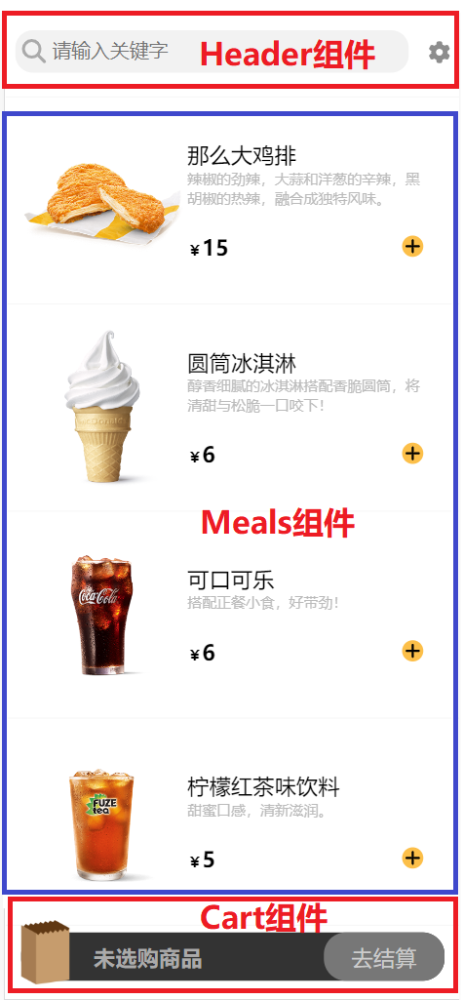

# React-Food-Project
主要技术栈


## 项目结构
```
|-- React-Food-Project
    |-- server.js
    |-- database
    |-- src
        |-- App.js
        |-- components
        |   |-- Cart
        |   |   |-- CartDetails
        |   |   |-- Checkout
        |   |-- Header
        |   |   |-- Diy
        |   |   |   |-- components
        |   |   |   |-- pages
        |   |   |   |-- store
        |   |   |-- SearchFood
        |   |-- Meals
        |   |   |-- Meal
        |   |-- UI
        |-- hooks
        |-- store
```
主要模块分为两部分：
* 第一部分是前端页面的展示，主要为顶部搜索栏，中间食品详情栏，以及底部购物车
* 第二部分是顶部DIY组件中的路由组件，这部分的数据保存在strapi数据管理系统中，通过fetch网络请求，以及react-toolkit发送网络连接进行数据的增删改查

最后通过express框架简单部署在本地服务器[5005] 端口


## 项目运行
首先在项目根目录下运行
```bash
npm build
```
产生build文件夹，因为项目的静态页面在express部署的根目录为build文件夹

之后在根目录下运行启动本地服务器进入5005端口
```bash
node server.js 
```
出现 LISTENING ON PORT 5005!后，顺利连接5005端口

同时还得进入database文件夹下，运行strapi后台服务器
```bash
npm start
```
这样就会展示出页面中食物数据和图片



登录密码
用户名:test
密码：test1234

[5005]:http://localhost:5005
